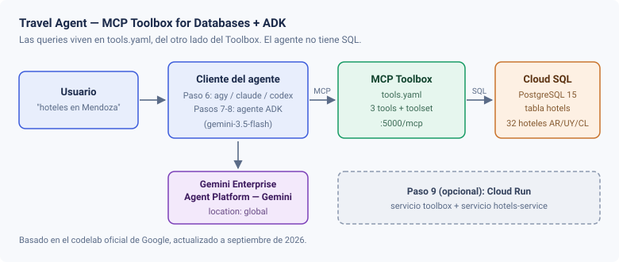

# Paso 1 — Introducción

> Paso 1 de 11 · [Índice del workshop](../../README.md)

## Qué vamos a construir

Un agente conversacional que responde preguntas sobre hoteles de Argentina, Uruguay y Chile consultando una base de datos PostgreSQL real.



## Las tres piezas

**Cloud SQL para PostgreSQL** guarda la tabla `hotels`: 32 hoteles en 13 ciudades de la región.

**MCP Toolbox for Databases** es un servidor que se para entre el agente y la base. Funciona como un *control plane* para tus tools: las consultas SQL se declaran en un archivo `tools.yaml` y el Toolbox las expone como *tools* vía [MCP](https://modelcontextprotocol.io/). Eso te da tres cosas:

- Las queries se definen **una vez** y las consumen todos los agentes y aplicaciones.
- Se actualizan sin redeployar el agente.
- Las credenciales de la base quedan del lado del Toolbox, no dentro del agente.

**Agent Development Kit (ADK)** es el framework con el que escribimos el agente en Python. El agente sólo declara qué toolset usar; no sabe nada de SQL.

## La idea que importa

Cuando termines el paso 8, el `agent.py` completo va a tener esta forma:

```python
toolbox = ToolboxSyncClient(TOOLBOX_URL)
tools = toolbox.load_toolset('my_first_toolset')

root_agent = Agent(name='hotel_agent', model='gemini-3.5-flash', tools=tools, ...)
```

Fijate en lo que **no** hay: ni una query SQL, ni una credencial de base, ni un cliente de Postgres. Todo eso vive en el `tools.yaml`, del otro lado del Toolbox.

Y como el Toolbox habla MCP, las mismas tools funcionan sin cambios desde Antigravity CLI, Claude Code o Codex. Eso es el paso 6.

## Lo que vas a hacer

1. Provisionar Cloud SQL para PostgreSQL y cargar los datos (pasos 2 a 4).
2. Configurar el MCP Toolbox con tres tools sobre esa base (paso 5).
3. Usar esas tools desde un CLI con agente, sin escribir código (paso 6).
4. Escribir tu propio agente con ADK y conectarlo a las mismas tools (pasos 7 y 8).
5. Opcionalmente, deployar las dos piezas en Cloud Run (paso 9).

## Requisitos

- Un proyecto de Google Cloud con facturación habilitada.
- **Cloud Shell** (recomendado) o un entorno local con `gcloud` y Python 3.10+.
- Para el paso 6, al menos uno de: Antigravity CLI, Claude Code o Codex.

> 💡 Si algo se rompe, casi seguro está en [docs/troubleshooting.md](../../docs/troubleshooting.md) con su causa y solución.

---

[Índice](../../README.md) · [Paso 2: Preparar el proyecto →](../02-preparar-proyecto/README.md)
