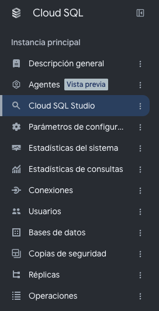
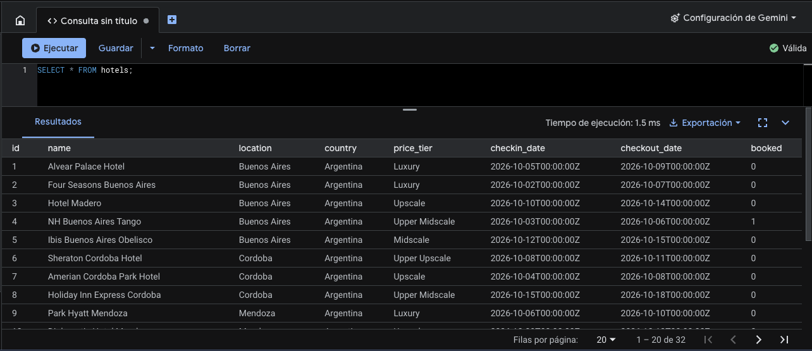

# Paso 4 — Preparar la base de hoteles

> Paso 4 de 11 · [Índice del workshop](../../README.md)

Vamos a crear la tabla y cargar 32 hoteles de Argentina, Uruguay y Chile.

Los archivos están listos en [`sql/`](sql/): [`01-schema.sql`](sql/01-schema.sql), [`02-seed.sql`](sql/02-seed.sql) y [`03-consultas.sql`](sql/03-consultas.sql).

> ℹ️ **Sobre los datos**: los nombres de los hoteles son reales para que el workshop se sienta familiar, pero **categorías, fechas y disponibilidad son ficticias**, inventadas para la demo.

## Abrir Cloud SQL Studio

1. Andá a [console.cloud.google.com/sql/instances](https://console.cloud.google.com/sql/instances).
2. Entrá a `hoteldb-instance`.
3. En el menú de la izquierda, **Cloud SQL Studio**.
4. Autenticate con:
   - Base de datos: `postgres`
   - Usuario: `postgres`
   - Contraseña: `postgres`



## Crear la tabla

Pegá esto en una pestaña del editor y ejecutalo ([`sql/01-schema.sql`](sql/01-schema.sql)):

```sql
CREATE TABLE hotels(
  id            INTEGER NOT NULL PRIMARY KEY,
  name          VARCHAR NOT NULL,
  location      VARCHAR NOT NULL,
  country       VARCHAR NOT NULL,
  price_tier    VARCHAR NOT NULL,
  checkin_date  DATE    NOT NULL,
  checkout_date DATE    NOT NULL,
  booked        BIT     NOT NULL
);
```

> 🔄 **Diferencia con el codelab original**: agregamos la columna `country`. Es lo que habilita la tercera tool del paso 5, `search-hotels-by-country`, para preguntas del tipo *"¿qué hoteles hay en Chile?"*.

Las categorías de `price_tier` son cinco, de menor a mayor precio: `Midscale`, `Upper Midscale`, `Upscale`, `Upper Upscale`, `Luxury`. Ese orden después lo usa una de las tools para ordenar los resultados.

## Cargar los datos

Copiá y ejecutá el script de abajo completo. Son 32 filas:

| País | Hoteles | Ciudades |
|---|---|---|
| 🇦🇷 Argentina | 18 | Buenos Aires, Córdoba, Mendoza, Bariloche, Salta, Rosario |
| 🇨🇱 Chile | 8 | Santiago, Valparaíso, Viña del Mar, Puerto Varas |
| 🇺🇾 Uruguay | 6 | Montevideo, Punta del Este, Colonia del Sacramento |

El script completo ([`sql/02-seed.sql`](sql/02-seed.sql)):

```sql
-- Datos de ejemplo: hoteles de Argentina, Uruguay y Chile.
--
-- IMPORTANTE: los nombres de los hoteles son reales para que el workshop se
-- sienta familiar, pero TODO el resto del dato es ficticio e inventado para la
-- demo: las categorías, las fechas y la disponibilidad no representan
-- información real de ningún establecimiento.
INSERT INTO hotels(id, name, location, country, price_tier, checkin_date, checkout_date, booked)
VALUES
  -- Argentina
  (1,  'Alvear Palace Hotel',           'Buenos Aires',           'Argentina', 'Luxury',         '2026-10-05', '2026-10-09', B'0'),
  (2,  'Four Seasons Buenos Aires',     'Buenos Aires',           'Argentina', 'Luxury',         '2026-10-02', '2026-10-07', B'0'),
  (3,  'Hotel Madero',                  'Buenos Aires',           'Argentina', 'Upscale',        '2026-10-10', '2026-10-14', B'0'),
  (4,  'NH Buenos Aires Tango',         'Buenos Aires',           'Argentina', 'Upper Midscale', '2026-10-03', '2026-10-06', B'1'),
  (5,  'Ibis Buenos Aires Obelisco',    'Buenos Aires',           'Argentina', 'Midscale',       '2026-10-12', '2026-10-15', B'0'),
  (6,  'Sheraton Cordoba Hotel',        'Cordoba',                'Argentina', 'Upper Upscale',  '2026-10-08', '2026-10-11', B'0'),
  (7,  'Amerian Cordoba Park Hotel',    'Cordoba',                'Argentina', 'Upscale',        '2026-10-04', '2026-10-08', B'0'),
  (8,  'Holiday Inn Express Cordoba',   'Cordoba',                'Argentina', 'Upper Midscale', '2026-10-15', '2026-10-18', B'0'),
  (9,  'Park Hyatt Mendoza',            'Mendoza',                'Argentina', 'Luxury',         '2026-10-06', '2026-10-10', B'0'),
  (10, 'Diplomatic Hotel Mendoza',      'Mendoza',                'Argentina', 'Upscale',        '2026-10-09', '2026-10-13', B'0'),
  (11, 'Hotel Argentino Mendoza',       'Mendoza',                'Argentina', 'Midscale',       '2026-10-01', '2026-10-04', B'1'),
  (12, 'Llao Llao Resort',              'Bariloche',              'Argentina', 'Luxury',         '2026-10-07', '2026-10-12', B'0'),
  (13, 'Hotel Panamericano Bariloche',  'Bariloche',              'Argentina', 'Upper Upscale',  '2026-10-11', '2026-10-15', B'0'),
  (14, 'Selina Bariloche',              'Bariloche',              'Argentina', 'Midscale',       '2026-10-02', '2026-10-05', B'0'),
  (15, 'Sheraton Salta Hotel',          'Salta',                  'Argentina', 'Upper Upscale',  '2026-10-13', '2026-10-17', B'0'),
  (16, 'Legado Mitico Salta',           'Salta',                  'Argentina', 'Upscale',        '2026-10-05', '2026-10-08', B'0'),
  (17, 'Ros Tower Hotel',               'Rosario',                'Argentina', 'Upscale',        '2026-10-14', '2026-10-17', B'0'),
  (18, 'Holiday Inn Rosario',           'Rosario',                'Argentina', 'Upper Midscale', '2026-10-03', '2026-10-07', B'0'),
  -- Uruguay
  (19, 'Sofitel Montevideo Casino Carrasco', 'Montevideo',        'Uruguay',   'Luxury',         '2026-10-04', '2026-10-09', B'0'),
  (20, 'Radisson Montevideo',           'Montevideo',             'Uruguay',   'Upper Upscale',  '2026-10-10', '2026-10-13', B'0'),
  (21, 'Ibis Montevideo',               'Montevideo',             'Uruguay',   'Midscale',       '2026-10-06', '2026-10-09', B'1'),
  (22, 'Hotel Fasano Las Piedras',      'Punta del Este',         'Uruguay',   'Luxury',         '2026-10-12', '2026-10-18', B'0'),
  (23, 'Enjoy Punta del Este',          'Punta del Este',         'Uruguay',   'Upper Upscale',  '2026-10-08', '2026-10-12', B'0'),
  (24, 'Charco Hotel',                  'Colonia del Sacramento', 'Uruguay',   'Upscale',        '2026-10-02', '2026-10-05', B'0'),
  -- Chile
  (25, 'The Singular Santiago',         'Santiago',               'Chile',     'Luxury',         '2026-10-05', '2026-10-10', B'0'),
  (26, 'W Santiago',                    'Santiago',               'Chile',     'Upper Upscale',  '2026-10-07', '2026-10-11', B'0'),
  (27, 'Hotel Cumbres Lastarria',       'Santiago',               'Chile',     'Upscale',        '2026-10-11', '2026-10-14', B'0'),
  (28, 'Ibis Santiago Providencia',     'Santiago',               'Chile',     'Midscale',       '2026-10-01', '2026-10-04', B'0'),
  (29, 'Hotel Casa Higueras',           'Valparaiso',             'Chile',     'Upscale',        '2026-10-09', '2026-10-12', B'0'),
  (30, 'Sheraton Miramar Vina del Mar', 'Vina del Mar',           'Chile',     'Upper Upscale',  '2026-10-13', '2026-10-16', B'0'),
  (31, 'Hotel Awa',                     'Puerto Varas',           'Chile',     'Luxury',         '2026-10-06', '2026-10-11', B'0'),
  (32, 'Hotel Cabana del Lago',         'Puerto Varas',           'Chile',     'Upper Midscale', '2026-10-15', '2026-10-19', B'0');
```

## Validar

```sql
SELECT * FROM hotels;
```

32 filas. Y un conteo por país:

```sql
SELECT country, COUNT(*) AS hoteles
FROM hotels
GROUP BY country
ORDER BY hoteles DESC;
```

```
country     | hoteles
------------+--------
Argentina   |      18
Chile       |       8
Uruguay     |       6
```



También podés probar de una la consulta exacta que va a ejecutar la tool del paso siguiente: busca por ciudad y ordena por precio de menor a mayor. Todas las consultas de validación juntas ([`sql/03-consultas.sql`](sql/03-consultas.sql)):

```sql
-- La misma consulta que va a ejecutar la tool `search-hotels-by-location`.
SELECT *
FROM hotels
WHERE location ILIKE '%' || 'Mendoza' || '%'
ORDER BY
  CASE price_tier
    WHEN 'Midscale' THEN 1
    WHEN 'Upper Midscale' THEN 2
    WHEN 'Upscale' THEN 3
    WHEN 'Upper Upscale' THEN 4
    WHEN 'Luxury' THEN 5
    ELSE 99
  END;
```

---

[← Paso 3](../03-cloud-sql/README.md) · [Índice](../../README.md) · [Paso 5: Setup del MCP Toolbox →](../05-mcp-toolbox/README.md)
