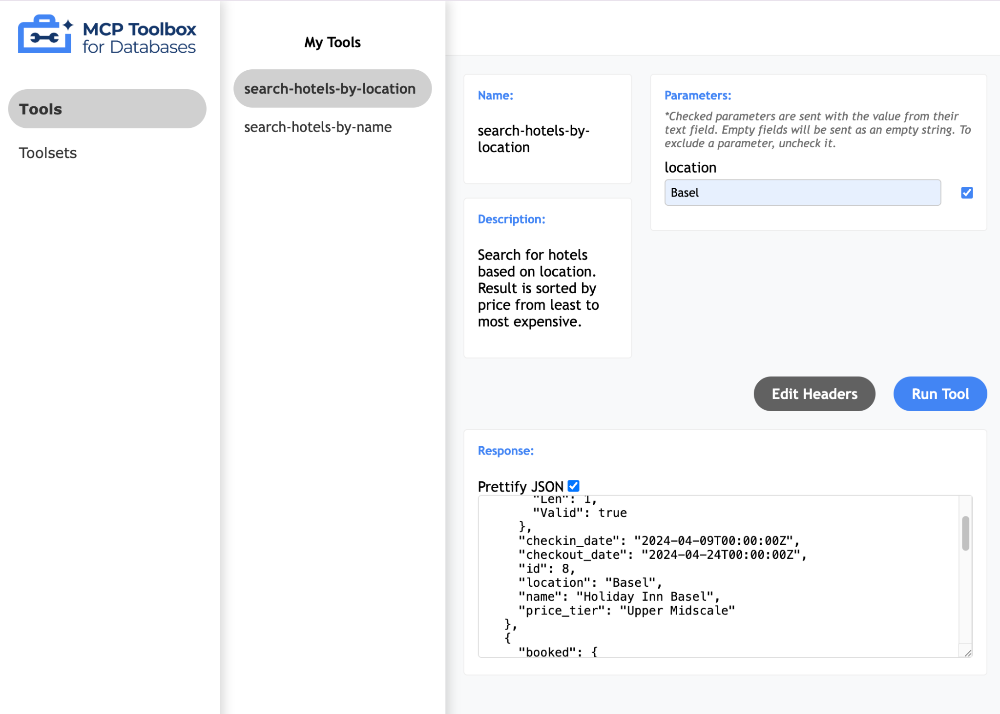

# Paso 5 — Setup del MCP Toolbox for Databases

> Paso 5 de 11 · [Índice del workshop](../../README.md)

Acá está el corazón del workshop: el Toolbox se para entre el agente y la base, y convierte consultas SQL declaradas en un YAML en tools MCP.

## 5.1 Instalar el binario

```bash
mkdir mcp-toolbox
cd mcp-toolbox
```

**Cloud Shell o Linux (amd64):**

```bash
export VERSION=1.12.0
curl -L -o toolbox https://storage.googleapis.com/mcp-toolbox-for-databases/v$VERSION/linux/amd64/toolbox
chmod +x toolbox
```

**macOS (Apple Silicon):**

```bash
export VERSION=1.12.0
curl -L -o toolbox https://storage.googleapis.com/mcp-toolbox-for-databases/v$VERSION/darwin/arm64/toolbox
chmod +x toolbox
```

Para otras plataformas cambiá `darwin/arm64` por `darwin/amd64`, `linux/arm64` o `windows/amd64`. El listado completo está en [releases](https://github.com/googleapis/mcp-toolbox/releases).

```bash
./toolbox -v
```

```
toolbox version 1.12.0+binary.linux.amd64.c97ca4d
```

> 🔄 **El codelab original usa la `1.1.0`, de abril de 2026.** Esta versión usa la **1.12.0**. Verificado: el `tools.yaml` es idéntico para las dos y no hay breaking changes entre ellas que afecten `cloud-sql-postgres`, `postgres-sql` ni `toolset`.
>
> Además el original tenía una inconsistencia: el paso 9 deploya la imagen `:latest`, que **hoy ya es la 1.12.0**. Tal cual estaba, local corría 1.1.0 y la nube 1.12.0.

## 5.2 Configurar las tools

Creá `tools.yaml` en la carpeta `mcp-toolbox`. El archivo completo está al final de esta sección (y en [`files/tools.yaml`](files/tools.yaml)) — copialo y **reemplazá `YOUR_PROJECT_ID`**.

El archivo tiene tres tipos de bloque, separados por `---`:

### La fuente de datos

```yaml
kind: source
name: my-cloud-sql-source
type: cloud-sql-postgres
project: YOUR_PROJECT_ID
region: us-central1
instance: hoteldb-instance
database: postgres
user: postgres
password: postgres
```

`cloud-sql-postgres` resuelve la conexión a través de la API de Cloud SQL usando tus credenciales (ADC). No hace falta abrir IPs ni configurar red.

### Las tools

Cada tool es una consulta con su descripción y sus parámetros tipados:

```yaml
kind: tool
name: search-hotels-by-location
type: postgres-sql
source: my-cloud-sql-source
description: Search for hotels based on location (city). Result is sorted by price from least to most expensive.
parameters:
  - name: location
    type: string
    description: The city where the hotel is located, for example 'Mendoza' or 'Montevideo'.
statement: |
  SELECT *
  FROM hotels
  WHERE location ILIKE '%' || $1 || '%'
  ORDER BY
    CASE price_tier
      WHEN 'Midscale' THEN 1
      WHEN 'Upper Midscale' THEN 2
      WHEN 'Upscale' THEN 3
      WHEN 'Upper Upscale' THEN 4
      WHEN 'Luxury' THEN 5
      ELSE 99
    END;
```

Dos cosas para señalar en vivo:

1. **La `description` es el prompt.** Es lo único que el modelo lee para decidir cuándo usar esta tool y qué pasarle. Una descripción vaga es un agente que elige mal.
2. **Los parámetros se bindean** (`$1`), no se interpolan como texto. No hay inyección SQL posible desde el prompt del usuario.

El workshop define tres tools:

| Tool | Busca por | Orden del resultado |
|---|---|---|
| `search-hotels-by-name` | nombre (parcial) | — |
| `search-hotels-by-location` | ciudad | precio, de menor a mayor |
| `search-hotels-by-country` | país | ciudad, y después precio |

> 🔄 `search-hotels-by-country` es un agregado de esta versión, para aprovechar la columna `country` y el dataset regional.

### El toolset

```yaml
kind: toolset
name: my_first_toolset
tools:
  - search-hotels-by-name
  - search-hotels-by-location
  - search-hotels-by-country
```

Agrupa las tools para cargarlas de una sola vez desde el agente (paso 8).

> En versiones recientes del Toolbox este concepto se renombró internamente a `group`. `kind: toolset` **sigue funcionando** en 1.12.0; sólo vas a ver `groups` en el log de arranque.

### El archivo completo

[`files/tools.yaml`](files/tools.yaml) — acordate de **reemplazar `YOUR_PROJECT_ID`**:

```yaml
# MCP Toolbox for Databases - configuración del workshop.
# Reemplazá YOUR_PROJECT_ID por el ID de tu proyecto de Google Cloud.
kind: source
name: my-cloud-sql-source
type: cloud-sql-postgres
project: YOUR_PROJECT_ID
region: us-central1
instance: hoteldb-instance
database: postgres
user: postgres
password: postgres
---
kind: tool
name: search-hotels-by-name
type: postgres-sql
source: my-cloud-sql-source
description: Search for hotels based on name.
parameters:
  - name: name
    type: string
    description: The name of the hotel.
statement: SELECT * FROM hotels WHERE name ILIKE '%' || $1 || '%';
---
kind: tool
name: search-hotels-by-location
type: postgres-sql
source: my-cloud-sql-source
description: Search for hotels based on location (city). Result is sorted by price from least to most expensive.
parameters:
  - name: location
    type: string
    description: The city where the hotel is located, for example 'Mendoza' or 'Montevideo'.
statement: |
  SELECT *
  FROM hotels
  WHERE location ILIKE '%' || $1 || '%'
  ORDER BY
    CASE price_tier
      WHEN 'Midscale' THEN 1
      WHEN 'Upper Midscale' THEN 2
      WHEN 'Upscale' THEN 3
      WHEN 'Upper Upscale' THEN 4
      WHEN 'Luxury' THEN 5
      ELSE 99 -- cualquier valor inesperado va al final
    END;
---
kind: tool
name: search-hotels-by-country
type: postgres-sql
source: my-cloud-sql-source
description: Search for hotels in a country. Use it when the user asks about a whole country instead of a city, for example 'hotels in Chile'. Result is sorted by city and then by price.
parameters:
  - name: country
    type: string
    description: The country, for example 'Argentina', 'Uruguay' or 'Chile'.
statement: |
  SELECT *
  FROM hotels
  WHERE country ILIKE '%' || $1 || '%'
  ORDER BY
    location,
    CASE price_tier
      WHEN 'Midscale' THEN 1
      WHEN 'Upper Midscale' THEN 2
      WHEN 'Upscale' THEN 3
      WHEN 'Upper Upscale' THEN 4
      WHEN 'Luxury' THEN 5
      ELSE 99
    END;
---
kind: toolset
name: my_first_toolset
tools:
  - search-hotels-by-name
  - search-hotels-by-location
  - search-hotels-by-country
```

## 5.3 Levantar el servidor

```bash
./toolbox --config "tools.yaml"
```

```
INFO "Starting MCP Toolbox for Databases version 1.12.0+binary.linux.amd64.c97ca4d"
INFO "Initialized 1 sources: my-cloud-sql-source"
INFO "Initialized 3 tools: search-hotels-by-country, search-hotels-by-name, search-hotels-by-location"
INFO "Initialized 2 groups: my_first_toolset, default"
WARN "wildcard (*) allows any website to access the primitives. ..."
WARN "wildcard (*) hosts allow any domain to access this resource, ..."
INFO "Server ready to serve!"
```

Los dos `WARN` son normales en desarrollo local; en un entorno real se acotan con `--allowed-origins` y `--allowed-hosts`.

Escucha en el puerto **5000**. Para cambiarlo:

```bash
./toolbox --config "tools.yaml" --port 7000
```

> 🍎 **En macOS usá otro puerto.** El 5000 lo ocupa AirPlay Receiver y `localhost` resuelve a `::1`, así que tu cliente recibe un 403 que no viene del Toolbox. Usá `--port 7000` y escribí `127.0.0.1`, no `localhost`. Detalle en [T7](../../docs/troubleshooting.md#t7-macos-el-puerto-5000-devuelve-403). En Cloud Shell no pasa.

## 5.4 Probar las tools en la UI del Toolbox

Cortá el servidor y levantalo con `--ui`:

```bash
./toolbox --config "tools.yaml" --ui
```

```
INFO "Toolbox UI is up and running at: http://127.0.0.1:5000/ui"
```

En Cloud Shell: **Web Preview** en el puerto 5000, y agregale `/ui` al final de la URL (si no, da 404).

Elegí `search-hotels-by-location`, pasale `Mendoza` y ejecutá. Resultado real:

```
Hotel Argentino Mendoza      Mendoza    Midscale
Diplomatic Hotel Mendoza     Mendoza    Upscale
Park Hyatt Mendoza           Mendoza    Luxury
```

Ese orden lo puso el `ORDER BY CASE price_tier` del YAML, no un modelo. Probá también `search-hotels-by-country` con `Uruguay`: devuelve 6 hoteles agrupados por ciudad.



> 📸 *Imagen provisoria del codelab original. Captura pendiente: `img/05-toolbox-ui.png` — la UI del Toolbox ejecutando `search-hotels-by-location` con `Mendoza`.*

Esta UI es tu **plan B para el workshop**: demuestra las tools sin depender de ningún modelo, login ni red externa.

> ℹ️ El endpoint REST `/api` viene deshabilitado por defecto y responde `410 Gone` (también en 1.1.0). No hace falta: los clientes MCP y `toolbox-core` hablan por `/mcp`.

## Desde acá, dos caminos

- **[Paso 6](../06-cli-agentes/README.md)**: usar estas tools desde un CLI con agente, sin escribir una línea de código.
- **[Pasos 7](../07-agente-adk/README.md) y [8](../08-conectar-tools/README.md)**: escribir tu propio agente con ADK.

Podés hacer los dos. Dejá el Toolbox corriendo en una terminal y seguí en otra.

---

[← Paso 4](../04-base-de-datos/README.md) · [Índice](../../README.md) · [Paso 6: Usar las tools desde un CLI →](../06-cli-agentes/README.md)
