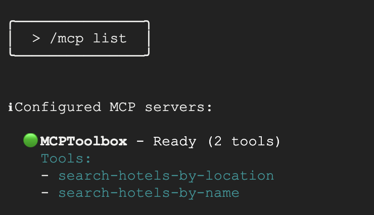

# Paso 6 — Usar las tools desde un CLI con agente

> Paso 6 de 11 · [Índice del workshop](../../README.md)

Ya tenés un servidor MCP funcionando. Lo bueno de MCP es que **cualquier** cliente puede consumirlo: acá lo conectamos a un CLI con agente y consultamos la base en lenguaje natural, sin escribir código.

> 🔄 **Este paso está reescrito respecto del codelab original.** El original usa **Gemini CLI**, que Google **retiró el 18 de junio de 2026** para cuentas free, Google AI Pro y Ultra, al consolidar su tooling bajo la marca Antigravity (anuncio en Google I/O, 19 de mayo de 2026). Las cuentas enterprise pueden seguir un tiempo más.
>
> El reemplazo oficial es **Antigravity CLI (`agy`)**. Abajo está esa opción y dos alternativas equivalentes, **Claude Code** y **Codex**, porque el servidor MCP es el mismo para todos.

**Requisito**: el Toolbox corriendo en otra terminal (`./toolbox --config "tools.yaml"`).

En los ejemplos uso `http://127.0.0.1:5000/mcp`. Ajustá el puerto si usaste `--port 7000`, y en macOS escribí `127.0.0.1`, no `localhost` ([T7](../../docs/troubleshooting.md#t7-macos-el-puerto-5000-devuelve-403)).

## Opción A — Antigravity CLI (`agy`)

El sucesor oficial de Gemini CLI.

**Instalar** (macOS y Linux, incluido Cloud Shell). Deja el binario en `~/.local/bin/agy`:

```bash
curl -fsSL https://antigravity.google/cli/install.sh | bash
agy --version
```

En Windows: `irm https://antigravity.google/cli/install.ps1 | iex`.

**Agregar el Toolbox.** El tipo `http` se detecta solo por la URL:

```bash
agy mcp add MCPToolbox http://127.0.0.1:5000/mcp
```

```
Added MCP server "MCPToolbox" (http)
```

**Listar:**

```bash
agy mcp list
```

```
NAME        TYPE  STATUS   COMMAND/URL
MCPToolbox  http  enabled  http://127.0.0.1:5000/mcp
```

**Arrancar y verificar:**

```bash
agy
```

Ya dentro, tipeá `/mcp` y Enter: se abre el **MCP Manager**, que muestra el estado real de cada servidor, permite recargar la configuración y ver los logs de conexión.



> 📸 *Imagen provisoria del codelab original. Captura pendiente: `img/06-agy-mcp.png` — el MCP Manager de `agy` mostrando MCPToolbox conectado.*

**Probalo:**

- `¿Qué hoteles hay en Mendoza?`
- `Contame más sobre el Llao Llao`
- `¿Qué opciones tengo en Uruguay?`

El CLI elige la tool adecuada y te pide permiso antes de ejecutarla. Los resultados vienen de tu base en Cloud SQL.

### Diferencias con `gemini mcp add`

Si venís del codelab original, cuatro cosas cambiaron:

1. **No existe `--scope="project"`.** `agy mcp add` escribe siempre en el config de usuario, `~/.gemini/config/mcp_config.json` (sí, sigue usando la carpeta `.gemini`). Para scope de proyecto tenés que escribir a mano `.agents/mcp_config.json`.
2. **No existe `--transport`.** Se detecta por la URL; para forzarlo, `--type http`. Y **los flags van antes del nombre**: si los ponés después, los rechaza.
3. **El campo JSON es `serverUrl`** — los legacy `url` y `httpUrl` no están soportados:
   ```json
   {
     "mcpServers": {
       "MCPToolbox": { "disabled": false, "serverUrl": "http://127.0.0.1:5000/mcp" }
     }
   }
   ```
4. **`agy mcp list` no valida la conexión**: sólo dice `enabled`, no el `✓ Connected` de Gemini CLI. La verificación real es con `/mcp` adentro de `agy`.

Y un paso del original que **ya no aplica**: los `export GOOGLE_CLOUD_PROJECT` y `export GOOGLE_CLOUD_LOCATION=global` para rutear al modelo. Antigravity CLI usa su propia autenticación y su propio catálogo de modelos (`agy models`); esas variables no se usan.

## Opción B — Claude Code

```bash
claude mcp add --transport http MCPToolbox http://127.0.0.1:5000/mcp
```

```
Added HTTP MCP server MCPToolbox with URL: http://127.0.0.1:5000/mcp to local config
```

Acá el health check sí es real:

```bash
claude mcp list
```

```
MCPToolbox: http://127.0.0.1:5000/mcp (HTTP) - ✔ Connected
```

Arrancá `claude`, tipeá `/mcp` para ver las tools, o preguntá directamente *"¿qué hoteles hay en Bariloche?"*.

Notas:

- El scope por defecto es `local` (privado tuyo en ese directorio, en `~/.claude.json`). Con `--scope project` escribe un `.mcp.json` versionable —ideal para un repo de workshop—, pero la primera vez que abras `claude` te va a pedir aprobar el servidor. Con `--scope user` queda en todos tus proyectos.
- Si `claude mcp list` dice `! Needs authentication` contra un Toolbox local sin auth, no está llegando al Toolbox. En macOS es [T7](../../docs/troubleshooting.md#t7-macos-el-puerto-5000-devuelve-403).
- Para sacarlo: `claude mcp remove MCPToolbox -s local`.

## Opción C — Codex CLI

```bash
codex mcp add MCPToolbox --url http://127.0.0.1:5000/mcp
```

```
Added global MCP server 'MCPToolbox'.
```

```bash
codex mcp list
```

```
Name        Url                        Bearer Token Env Var  Status   Auth
MCPToolbox  http://127.0.0.1:5000/mcp  -                     enabled  Unsupported
```

`Auth: Unsupported` sólo significa que el servidor no expone OAuth, que es lo normal en un Toolbox local.

Notas:

- Escribe en `~/.codex/config.toml` (scope global, no hay scope de proyecto):
  ```toml
  [mcp_servers.MCPToolbox]
  url = "http://127.0.0.1:5000/mcp"
  ```
- Si el servidor pidiera token: `--bearer-token-env-var NOMBRE_VARIABLE`.
- Para servidores stdio: `codex mcp add <nombre> -- <comando> [args...]`.
- `codex mcp list` tampoco prueba la conexión: verificá con `/mcp` dentro de `codex`.
- Para sacarlo: `codex mcp remove MCPToolbox`.

## Las tres, comparadas

| | Antigravity CLI | Claude Code | Codex |
|---|---|---|---|
| Comando | `agy mcp add <n> <url>` | `claude mcp add --transport http <n> <url>` | `codex mcp add <n> --url <url>` |
| Detecta HTTP por la URL | Sí | No | No |
| Scope de proyecto | Sólo a mano | Sí (`--scope project`) | No |
| Config | `~/.gemini/config/mcp_config.json` | `~/.claude.json` o `.mcp.json` | `~/.codex/config.toml` |
| Campo de la URL | `serverUrl` | `url` | `url` |
| `list` valida conexión | No | **Sí** | No |
| Ver tools en sesión | `/mcp` | `/mcp` | `/mcp` |

Lo que importa del paso: **no cambiaste nada del servidor**. El mismo `tools.yaml`, los mismos tres tools, tres clientes distintos.

---

[← Paso 5](../05-mcp-toolbox/README.md) · [Índice](../../README.md) · [Paso 7: Escribir el agente con ADK →](../07-agente-adk/README.md)
