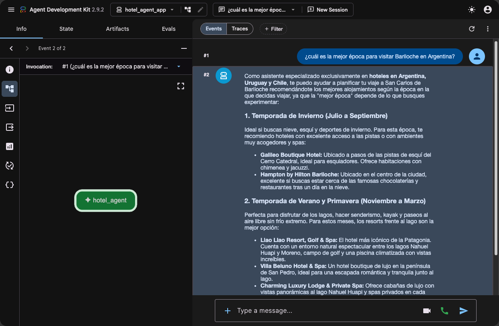

# Paso 7 — Escribir el agente con ADK

> Paso 7 de 11 · [Índice del workshop](../../README.md)

Ahora escribimos nuestro propio agente con el **Agent Development Kit**. En este paso el agente todavía no tiene tools: primero lo hacemos andar, y en el paso 8 lo conectamos al Toolbox.

## 7.1 Entorno virtual

```bash
mkdir my-agents
cd my-agents

python3 -m venv .venv
source .venv/bin/activate

pip install -U pip
pip install google-adk toolbox-core
```

Verificá **qué versión quedó y de dónde sale**:

```bash
which adk && adk --version
```

Tiene que decir `.../.venv/bin/adk` y **2.9.2 o superior**.

> ⚠️ Si te aparece una versión vieja (por ejemplo 2.6.2), es [T6](../../docs/troubleshooting.md#t6-pip-install-google-adk-me-dejó-una-versión-vieja): el `$HOME` de Cloud Shell es persistente y pip puede estar viendo una instalación anterior en `~/.local`. **Resolvelo antes de seguir**: las versiones menores a 2.9.0 fallan en el paso 9.

```bash
adk
```

```
Usage: adk [OPTIONS] COMMAND [ARGS]...

Commands:
  api_server   Starts a FastAPI server for agents.
  create       Creates a new app in the current folder with prepopulated...
  deploy       Deploys agent to hosted environments.
  eval         Evaluates an agent given the eval sets.
  run          Runs an agent.
  web          Starts a FastAPI server with Web UI for agents.
  ...
```

## 7.2 Crear la aplicación

```bash
adk create hotel_agent_app
```

El diálogo, en ADK 2.x:

```
Choose a model for the root agent:
1. gemini-3.5-flash
2. Other models (fill later)
Choose model (1, 2): 1

1. Google AI
2. Vertex AI
3. Login with Google
Choose a backend (1, 2, 3): 2

Enter Google Cloud project ID [YOUR_PROJECT_ID]:
Enter Google Cloud region [us-central1]: global

Agent created in <HOME>/my-agents/hotel_agent_app:
- .env
- .gitignore
- __init__.py
- agent.py
```

> 🔄 **Cambios respecto del codelab original**: el modelo de la opción 1 ahora es `gemini-3.5-flash` (antes `gemini-2.5-flash`), hay una tercera opción de backend, y se genera además un `.gitignore`.

Elegí **1** (modelo) y **2** (Vertex AI), y aceptá proyecto y usa `global` como región.

> ⚠️ Revisa que quede **GOOGLE_CLOUD_LOCATION=global**
> `adk create` escribe la región que le diste, pero **`gemini-3.5-flash` no existe en `us-central1`**: sólo está en la location `global`. Abrí `hotel_agent_app/.env` y dejalo así (plantilla en [`files/.env.example`](files/.env.example)):
>
> ```
> GOOGLE_GENAI_USE_ENTERPRISE=1
> GOOGLE_CLOUD_PROJECT=YOUR_PROJECT_ID
> GOOGLE_CLOUD_LOCATION=global
> ```
>
> Si no lo cambiás, el agente arranca bien y falla recién con el primer mensaje:
>
> ```
> 404 NOT_FOUND. Publisher model `projects/.../locations/us-central1/publishers/google/models/gemini-3.5-flash` was not > found...
> ```

Detalle y matriz de modelos por location en [T2](../../docs/troubleshooting.md#t2-404-not_found-publisher-model--was-not-found). Esto sólo afecta al endpoint del modelo: Cloud SQL y el Toolbox siguen en `us-central1`.

> 🔄 La variable `GOOGLE_GENAI_USE_ENTERPRISE` antes se llamaba `GOOGLE_GENAI_USE_VERTEXAI`. La vieja sigue soportada por compatibilidad (si están las dos con valores distintos, gana la nueva y avisa por warning), así que material viejo no se rompe.

### El agente generado

```python
from google.adk.agents.llm_agent import Agent

root_agent = Agent(
    model='gemini-3.5-flash',
    name='root_agent',
    description='A helpful assistant for user questions.',
    instruction='Answer user questions to the best of your knowledge',
)
```

Reemplazalo por esto ([`files/agent.py`](files/agent.py)), que acota el alcance:

```python
from google.adk.agents import Agent

root_agent = Agent(
    model='gemini-3.5-flash',
    name='hotel_agent',
    description='A helpful assistant that answers questions about hotels in South America.',
    instruction=(
        'Answer user questions about hotels in Argentina, Uruguay and Chile to the '
        'best of your knowledge. Do not answer questions outside of this.'
    ),
)
```

> ADK 2.x genera `from google.adk.agents.llm_agent import Agent`. El import corto, `from google.adk.agents import Agent`, sigue funcionando: resuelve a la misma clase.

## 7.3 Probarlo en el browser

Desde `my-agents` (no desde dentro de `hotel_agent_app`):

```bash
adk web --allow_origins '*'
```

> 🔴 **El `--allow_origins '*'` no es opcional en Cloud Shell.** Sin él, la página queda en blanco y vas a ver `403 Forbidden` en todos los `.js` del log: ADK 2.x trae un middleware anti DNS-rebinding que rechaza el origen del Web Preview. Es [T1](../../docs/troubleshooting.md#t1-adk-web-en-cloud-shell-página-en-blanco-y-403-en-los-js), con la explicación de por qué falla sólo el JavaScript y qué implica el `*`.

```
+-----------------------------------------------------------------------------+
| ADK Web Server started                                                      |
| For local testing, access at http://127.0.0.1:8000.                         |
+-----------------------------------------------------------------------------+
```

En Cloud Shell: **Web Preview** en el puerto 8000. Elegí `hotel_agent_app` en el selector y preguntale algo como *"¿cuál es la mejor época para visitar Bariloche?"*. Va a responder con conocimiento del modelo, **sin tocar la base**.



## 7.4 Probarlo en la terminal

```bash
adk run hotel_agent_app
```

Se sale con `exit`. Esta variante no usa browser ni middleware: es el camino más robusto si el Web Preview te pelea.

Probá preguntarle *"¿qué hoteles hay en Mendoza?"*. Te va a contestar algo genérico o inventado: todavía no tiene cómo consultar la base. Eso es exactamente lo que arreglamos en el paso siguiente.

---

[← Paso 6](../06-cli-agentes/README.md) · [Índice](../../README.md) · [Paso 8: Conectar el agente a las tools →](../08-conectar-tools/README.md)
