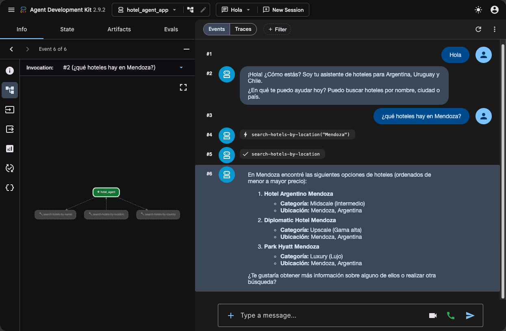

# Paso 9 — Deploy a Cloud Run (opcional)

> Paso 9 de 11 · [Índice del workshop](../../README.md)

Hasta acá todo corrió local. Ahora publicamos las dos piezas como servicios: primero el Toolbox, después el agente.

> ⚠️ **Requiere ADK ≥ 2.9.0.** Con versiones anteriores este paso se traba: deployan siempre contra una feature beta de Cloud Run y la revisión puede quedar colgada para siempre ([T5](../../docs/troubleshooting.md#t5-la-revisión-de-cloud-run-nunca-queda-ready)). Chequeá con `adk --version` antes de empezar.

## 9.1 El Toolbox en Cloud Run

Desde la carpeta `mcp-toolbox` (donde está tu `tools.yaml`):

```bash
export PROJECT_ID=$(gcloud config get-value project)

gcloud services enable run.googleapis.com \
                       cloudbuild.googleapis.com \
                       artifactregistry.googleapis.com \
                       iam.googleapis.com \
                       secretmanager.googleapis.com
```

Una service account dedicada, con permiso de leer secretos y de hablar con Cloud SQL:

```bash
gcloud iam service-accounts create toolbox-identity

gcloud projects add-iam-policy-binding $PROJECT_ID \
   --member serviceAccount:toolbox-identity@$PROJECT_ID.iam.gserviceaccount.com \
   --role roles/secretmanager.secretAccessor

gcloud projects add-iam-policy-binding $PROJECT_ID \
   --member serviceAccount:toolbox-identity@$PROJECT_ID.iam.gserviceaccount.com \
   --role roles/cloudsql.client
```

El `tools.yaml` tiene la password de la base, así que va como secreto y no dentro de la imagen:

```bash
gcloud secrets create tools --data-file=tools.yaml

export IMAGE=us-central1-docker.pkg.dev/database-toolbox/toolbox/toolbox:1.12.0
```

> 🔄 El codelab original usa `:latest`. Pinear `1.12.0` te da builds reproducibles y evita la inconsistencia de correr una versión local y otra en la nube. (`:latest` hoy resuelve justamente a 1.12.0.)

```bash
gcloud run deploy toolbox \
--image $IMAGE \
--service-account toolbox-identity \
--region us-central1 \
--set-secrets "/app/tools.yaml=tools:latest" \
--args="--config=/app/tools.yaml","--address=0.0.0.0","--port=8080" \
--allow-unauthenticated
```

```
Service [toolbox] revision [toolbox-00001-zsk] has been deployed and is serving 100 percent of traffic.
Service URL: https://toolbox-<ID>-uc.a.run.app
```

Guardate esa URL:

```bash
export TOOLBOX_URL=https://toolbox-<ID>-uc.a.run.app
```

> 🔒 **`--allow-unauthenticated` deja el Toolbox público**, con acceso a tu base. Está bien para una demo con datos ficticios; para cualquier otra cosa, sacá el flag y autenticá al llamador.


## 9.2 Apuntar el agente al Toolbox de la nube

Como el `agent.py` del paso 8 lee `TOOLBOX_URL` del entorno, **no hay que editar código**:

```bash
export TOOLBOX_URL=https://toolbox-<ID>-uc.a.run.app
```

Probá local contra el Toolbox de la nube antes de deployar el agente:

```bash
adk run hotel_agent_app/
```

Si responde con hoteles, el Toolbox de Cloud Run funciona.

## 9.3 El agente en Cloud Run

Desde `my-agents`:

```bash
export GOOGLE_CLOUD_PROJECT=$(gcloud config get-value project)
export CLOUD_RUN_REGION=us-central1
export MODEL_LOCATION=global
export AGENT_PATH="hotel_agent_app/"
export SERVICE_NAME="hotels-service"
export APP_NAME="hotels-app"
export GOOGLE_GENAI_USE_ENTERPRISE=1
```

> 🔴 **Dos variables, no una.** El codelab original usa `GOOGLE_CLOUD_LOCATION` para las dos cosas y después hace `--region=$GOOGLE_CLOUD_LOCATION`. Con `gemini-3.5-flash` eso no se puede: la región de Cloud Run tiene que ser una región real y la location del modelo tiene que ser `global`. Si pusieras `GOOGLE_CLOUD_LOCATION=global`, el deploy intentaría crear el servicio en una región llamada "global" y fallaría.

Creá `requirements.txt` **dentro de `hotel_agent_app`** ([`files/requirements.txt`](../08-conectar-tools/files/requirements.txt)):

```
google-adk==2.9.2
toolbox-core==1.4.0
```

Y deployá:

```bash
adk deploy cloud_run \
--project=$GOOGLE_CLOUD_PROJECT \
--region=$CLOUD_RUN_REGION \
--service_name=$SERVICE_NAME \
--app_name=$APP_NAME \
--with_ui \
--env TOOLBOX_URL=$TOOLBOX_URL \
--env GOOGLE_CLOUD_LOCATION=$MODEL_LOCATION \
$AGENT_PATH
```

> Los `--env` requieren **ADK ≥ 2.9.0** ([T4](../../docs/troubleshooting.md#t4-error-no-such-option---env)). El de `GOOGLE_CLOUD_LOCATION` es redundante con el `os.environ` que ya tiene el `agent.py`, pero explícito es mejor: si alguien saca esa línea del código, el deploy sigue funcionando. El de `TOOLBOX_URL` sí es imprescindible, porque sin él el contenedor cae al default `127.0.0.1:5000` — y ahí el arranque se cuelga, porque `ToolboxSyncClient` hace una llamada HTTP en el import.

```
Service [hotels-service] revision [hotels-service-00001-abc] has been deployed and is serving 100 percent of traffic.
Service URL: https://hotels-service-<ID>-uc.a.run.app
```

Abrí la Service URL: tenés la misma UI de `adk web`, servida desde Cloud Run, consultando la base a través del Toolbox también hosteado en Cloud Run.



## Si el deploy se traba

No adivines: mirá el estado real.

```bash
gcloud run services list --format="table(metadata.name,status.url,status.conditions[0].status)"

gcloud run revisions list --service hotels-service --region us-central1 \
  --format="table(metadata.name,status.conditions[0].status,status.conditions[0].message)"

# ¿arrancó el contenedor alguna vez?
gcloud logging read \
  'resource.type="cloud_run_revision" AND resource.labels.service_name="hotels-service"' \
  --limit 20 --freshness=1h --format="value(timestamp,textPayload)"
```

La regla para leer eso: **si no hay logs de aplicación, tu código no es el problema** — nunca se ejecutó. Los dos casos y sus causas están en [T5](../../docs/troubleshooting.md#t5-la-revisión-de-cloud-run-nunca-queda-ready).

Y si el servicio arranca pero el chat responde con un 404 del modelo, es [T3](../../docs/troubleshooting.md#t3-en-cloud-run-el-modelo-vuelve-a-us-central1).

---

[← Paso 8](../08-conectar-tools/README.md) · [Índice](../../README.md) · [Paso 10: Limpieza →](../10-limpieza/README.md)
